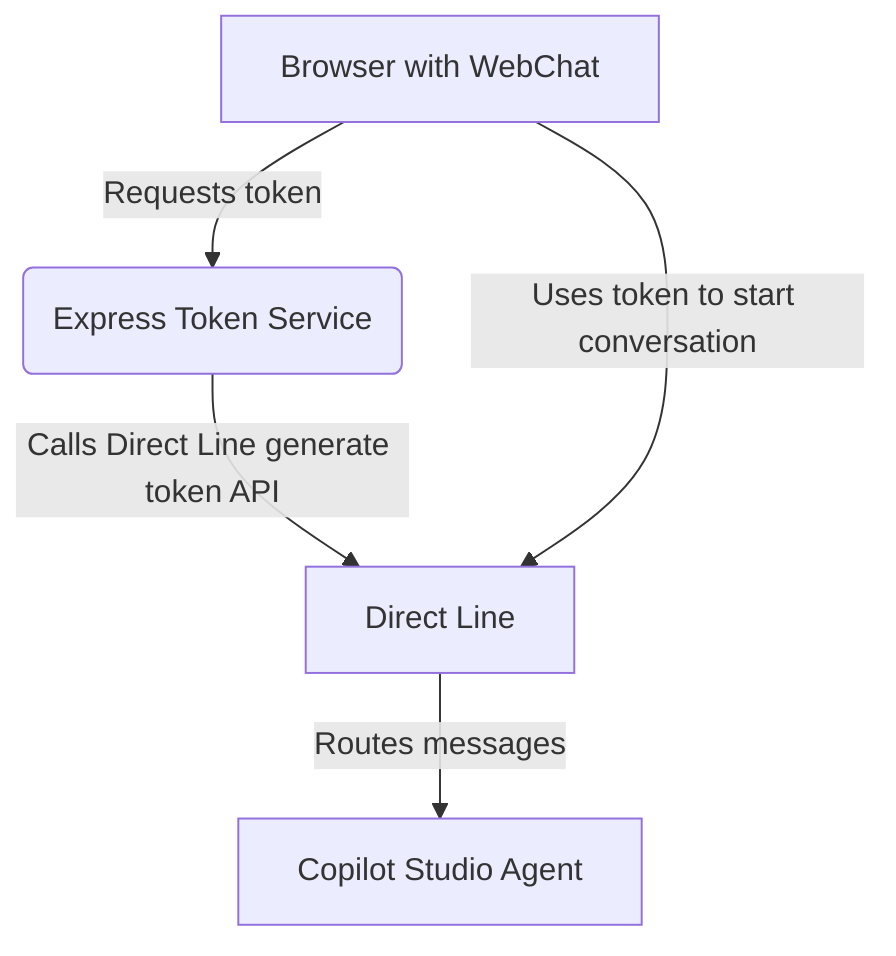

# WebChat with Copilot Studio Agent

This project demonstrates how to connect a frontend built with WebChat to a Microsoft Copilot Studio Agent (formerly Power Virtual Agents). A small Node.js backend issues Direct Line tokens so the browser can securely talk to the agent.

## Project Structure

```
backend/    # Express service that issues Direct Line tokens
frontend/   # Static WebChat page
```

## Setup and Run Instructions

1. **Install dependencies**

   ```bash
   cd backend
   npm install
   ```

2. **Create a `.env` file** inside `backend/` based on `.env.example` and set your Direct Line secret.

3. **Run the backend**

   ```bash
   node servers.js
   ```

4. **Serve the frontend** (any static server works). For quick testing you can run:

   ```bash
   cd ../frontend
   python -m http.server 8080
   ```

   Visit `http://localhost:8080` and ensure the `API_BASE_URL` constant in `frontend/index.html` matches the backend URL.

## Installation and Dependency Guide

- [Node.js 18+](https://nodejs.org/)
- [`express`](https://expressjs.com/) – web framework
- [`axios`](https://axios-http.com/) – HTTP client to call Direct Line
- [`cors`](https://github.com/expressjs/cors) – CORS middleware
- [`dotenv`](https://github.com/motdotla/dotenv) – load environment variables

Install them with `npm install` inside the `backend` folder.

## Environment Setup

Configuration is done via environment variables loaded from `backend/.env`:

| Variable | Description |
|----------|-------------|
| `DIRECT_LINE_SECRET` | Secret for the Direct Line channel of your Copilot Studio agent |
| `PORT` | Port for the server (default `3978`) |
| `HOST` | Host interface to bind (default `0.0.0.0`) |

## Testing and Debugging

- Access `http://localhost:3978/api/token` to verify the backend returns a token.
- Open the browser console on `http://localhost:8080` to inspect WebChat activity.
- Use tools like [ngrok](https://ngrok.com/) if you need to expose the bot externally for testing.

## Deployment Hints

The backend is a lightweight Express application that can run on any Node.js host (e.g., Azure App Service). The frontend can be served from a static host such as Azure Static Web Apps.

## System Architecture



## Managing Copilot Studio Agent Environments

Environments for Copilot Studio agents are created and managed in the **Power Platform Admin Center** (<https://admin.powerplatform.microsoft.com>). Each environment corresponds to an Azure resource group behind the scenes. Use the Admin Center to create environments, assign security roles, and configure channels (e.g., Direct Line). You can view the associated resources in the Azure Portal by navigating to the resource group named after your Power Platform environment.

## Self‑Review

- **Modularity** – The backend is a simple Express app with a single responsibility: issuing Direct Line tokens. Frontend code is kept minimal.
- **Environment Variables** – All secrets and configuration are read from `.env` using `dotenv`.
- **Idiomatic Code** – The server follows typical Express conventions.
